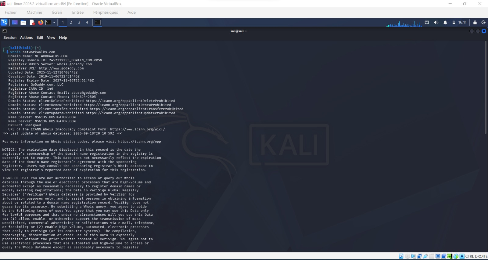
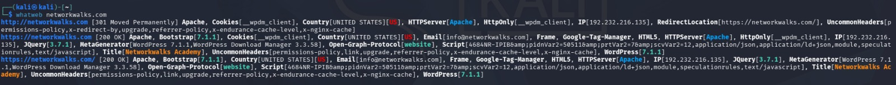
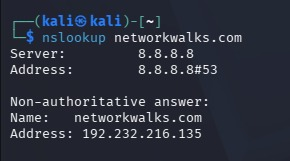
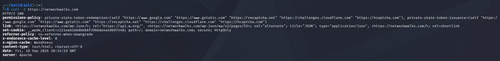
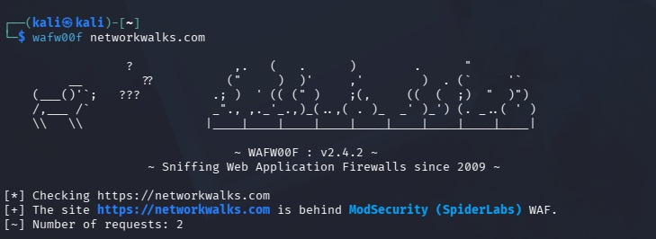
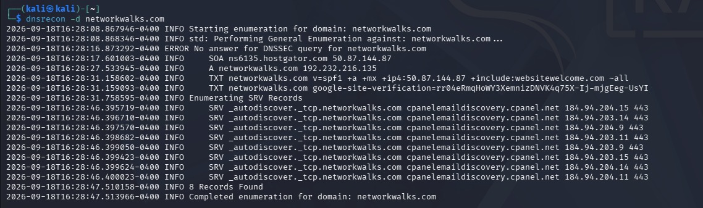

# 🔎 Footprinting & Reconnaissance with Kali Linux

## 📌 Project Overview

This project presents the completion of a **Footprinting & Reconnaissance** laboratory using **Kali Linux** and several built-in reconnaissance tools.

The objective of this practical lab is to collect publicly available information about a target domain in order to build an initial profile of its infrastructure.

The following six tools were used throughout the laboratory:

* `whois`
* `whatweb`
* `nslookup`
* `curl`
* `wafw00f`
* `dnsrecon`

---

# 🎯 Objectives

The main objectives of this laboratory are to:

* Identify public domain registration information;
* Identify the technologies used by a web application;
* Resolve a domain name to its IP address;
* Analyze HTTP response headers;
* Detect the presence of a Web Application Firewall (WAF);
* Enumerate available DNS records;
* Understand the importance of reconnaissance during a security assessment.

Reconnaissance is an important preliminary phase of a security assessment because it helps identify and understand the target's publicly exposed infrastructure before conducting further security analysis.

---

# 🖥️ Laboratory Environment

## Operating System

* **Kali Linux**

## Tools Used

| Tool       | Purpose                            |
| ---------- | ---------------------------------- |
| `whois`    | Domain registration information    |
| `whatweb`  | Web technology fingerprinting      |
| `nslookup` | DNS resolution                     |
| `curl`     | HTTP header analysis               |
| `wafw00f`  | Web Application Firewall detection |
| `dnsrecon` | DNS enumeration                    |

## Target

```text
networkwalks.com
```

---

# 🧪 TASK 1 WHOIS

## 🎯 Objective

The first task consists of querying the public registration information associated with the target domain.

The information of interest includes:

* Domain registrar;
* Registration date;
* Expiration date;
* Name servers;
* Public registration information.

## 💻 Command

The following command was executed in the Kali Linux terminal:

```bash
whois networkwalks.com
```

## 📸 WHOIS




## 📄 Analysis

The `whois` command provides publicly available information about the domain registration.

The results can provide information such as the registrar, registration dates, expiration dates, and name servers.

The name servers can also provide useful information about the infrastructure or hosting environment associated with the domain.

---

# 🧪 TASK 2 WHATWEB

## 🎯 Objective

The objective of this task is to identify the technologies used by the target website.

`WhatWeb` can identify information such as:

* Web server;
* Content Management System (CMS);
* Frameworks;
* Plugins;
* Software versions;
* IP address.

## 💻 Command

The following command was executed:

```bash
whatweb networkwalks.com
```

## 📸 WHATWEB




## 📄 Analysis

The `whatweb` command fingerprints the target website and identifies technologies that are publicly exposed.

This information can help security analysts understand the technology stack used by the application.

Identifying the technologies and versions can also be useful during a security assessment because they provide information about the application's attack surface.

---

# 🧪 TASK 3 NSLOOKUP

## 🎯 Objective

The objective of this task is to resolve the target domain and identify its associated IP address.

## 💻 Command

The following command was executed:

```bash
nslookup networkwalks.com
```

## 📸 NSLOOKUP




## 📄 Analysis

The `nslookup` command queries DNS information for the specified domain.

It can be used to determine the IP address associated with a domain name.

The TP documentation identifies the following IP address:

```text
192.232.216.135
```

The IP address provides additional information about the network infrastructure associated with the target domain.

---

# 🧪 TASK 4 CURL / HTTP HEADERS

## 🎯 Objective

The objective of this task is to analyze the HTTP response headers returned by the web server.

HTTP headers can provide information about:

* HTTP status code;
* Web server;
* Cookies;
* Redirects;
* Caching mechanisms;
* Other technologies or services exposed by the application.

## 💻 Command

The following command was executed:

```bash
curl -I https://networkwalks.com
```

## 📸 CURL




## 📄 Analysis

The `curl -I` command requests the HTTP headers without retrieving the complete web page.

Analyzing these headers can reveal information about the web server and the technologies involved in delivering the application.

The laboratory documentation also mentions the exposure of the WordPress REST API through:

```text
/wp-json/
```

---

# 🧪 TASK 5 WAFW00F

## 🎯 Objective

The objective of this task is to determine whether the target website is protected by a **Web Application Firewall (WAF)**.

## 💻 Command

The following command was executed:

```bash
wafw00f networkwalks.com
```

## 📸 WAFW00F




## 📄 Analysis

`wafw00f` analyzes the behavior of a web application to determine whether a Web Application Firewall is present.

According to the laboratory documentation, the target was identified as being protected by:

```text
ModSecurity / SpiderLabs
```

The identification of a WAF is an important part of understanding the security mechanisms protecting a web application.

---

# 🧪 TASK 6 DNSRECON

## 🎯 Objective

The objective of this task is to enumerate DNS information associated with the target domain.

The enumeration focuses on information such as:

* Name servers;
* Mail servers;
* SPF records;
* TXT records;
* SRV records;
* DNS-related services.

## 💻 Command

The following command was executed:

```bash
dnsrecon -d networkwalks.com
```

## 📸 DNSRECON




## 📄 Analysis

The `dnsrecon` tool allows several DNS records and configuration details to be collected.

The results can provide information about the domain's DNS infrastructure, mail servers, SPF configuration, TXT records, and service records.

This information contributes to a better understanding of the publicly exposed infrastructure.


---

# 📊 Summary of the Tasks

| # | Tool     | Command                            | Main Information Collected      |
| - | -------- | ---------------------------------- | ------------------------------- |
| 1 | WHOIS    | `whois networkwalks.com`           | Domain registration information |
| 2 | WhatWeb  | `whatweb networkwalks.com`         | Web technologies                |
| 3 | NSLOOKUP | `nslookup networkwalks.com`        | DNS information and IP address  |
| 4 | cURL     | `curl -I https://networkwalks.com` | HTTP response headers           |
| 5 | WAFW00F  | `wafw00f networkwalks.com`         | WAF detection                   |
| 6 | DNSRecon | `dnsrecon -d networkwalks.com`     | DNS enumeration                 |

---

# 🔗 Reconnaissance Information Flow

The information collected from the different tools can be viewed as a progressive reconnaissance process:

```text
                         Target Domain
                              │
                              ▼
                    ┌──────────────────┐
                    │     WHOIS        │
                    │ Domain Details   │
                    └────────┬─────────┘
                             │
                             ▼
                    ┌──────────────────┐
                    │    NSLOOKUP      │
                    │   DNS / IP       │
                    └────────┬─────────┘
                             │
              ┌──────────────┴──────────────┐
              │                             │
              ▼                             ▼
     ┌──────────────────┐          ┌──────────────────┐
     │     WHATWEB      │          │    DNSRECON      │
     │ Web Technologies │          │   DNS Records    │
     └────────┬─────────┘          └────────┬─────────┘
              │                             │
              └──────────────┬──────────────┘
                             ▼
                    ┌──────────────────┐
                    │      CURL        │
                    │   HTTP Headers   │
                    └────────┬─────────┘
                             │
                             ▼
                    ┌──────────────────┐
                    │     WAFW00F      │
                    │    WAF Detection │
                    └──────────────────┘
```


# 🔐 Why Footprinting Matters

Footprinting is an important phase of cybersecurity assessments because it provides information about the publicly exposed attack surface of an organization.

The different tools used in this laboratory provide complementary information:

```text
WHOIS
   ↓
Domain Registration Information
   ↓
NSLOOKUP
   ↓
DNS / IP Information
   ↓
WHATWEB
   ↓
Web Technologies
   ↓
CURL
   ↓
HTTP Information
   ↓
WAFW00F
   ↓
Security Protection
   ↓
DNSRECON
   ↓
DNS Infrastructure
```

By combining these results, a security analyst can build an initial understanding of the target environment before proceeding to other authorized security testing activities.


# ⚖️ Ethical Use Disclaimer

This repository was created for **educational and cybersecurity training purposes**.

The techniques and commands presented in this project must only be used:

* In a controlled laboratory environment;
* Against systems owned by the tester;
* Or against systems for which explicit authorization has been obtained.

Unauthorized reconnaissance or security testing may violate laws, regulations, or organizational policies.

The purpose of this project is to develop practical knowledge of **cybersecurity, reconnaissance, and Ethical Hacking**.


## 👩‍💻 Author

**Cybersecurity & Ethical Hacking Student**

> Practical cybersecurity laboratory — Footprinting & Reconnaissance with Kali Linux
